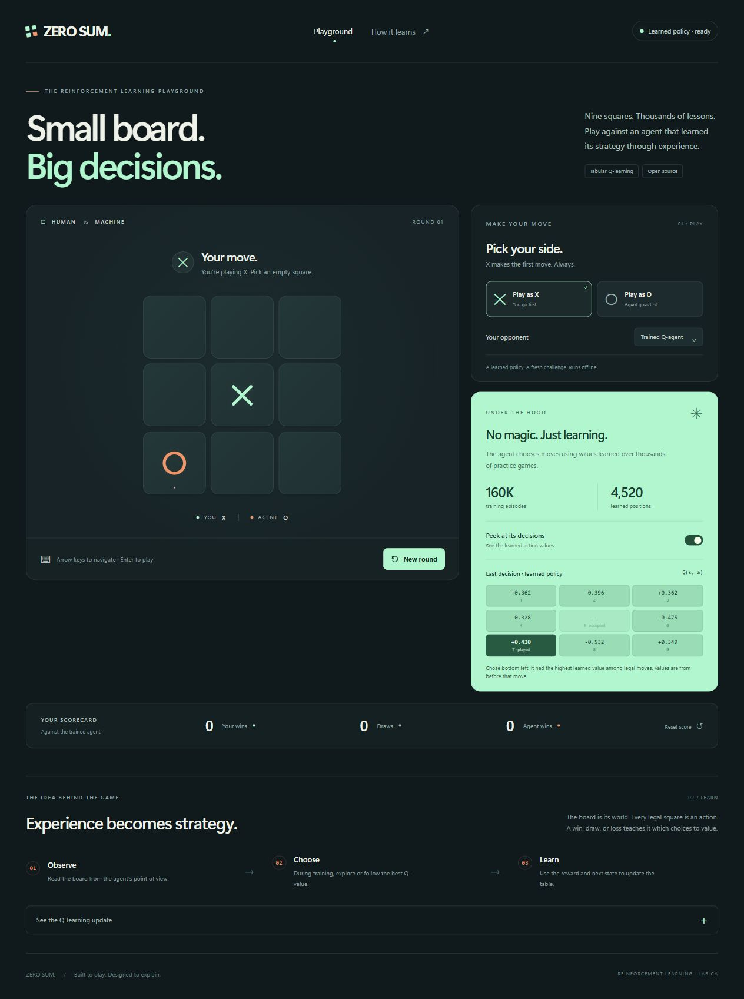
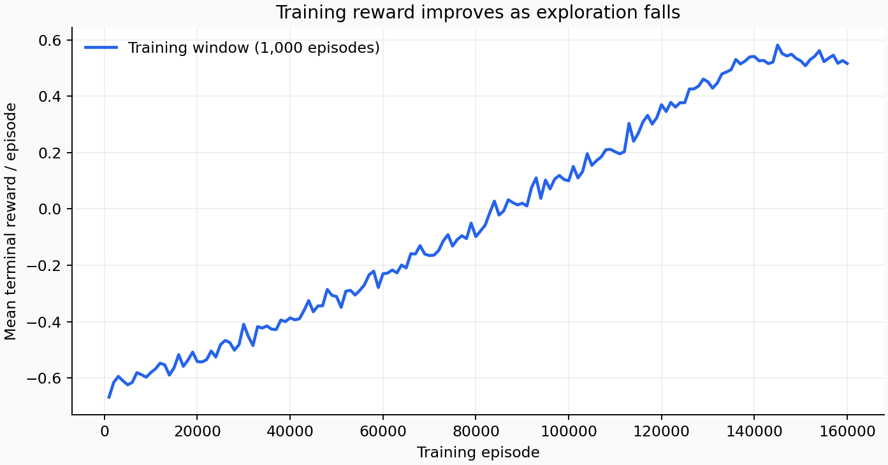
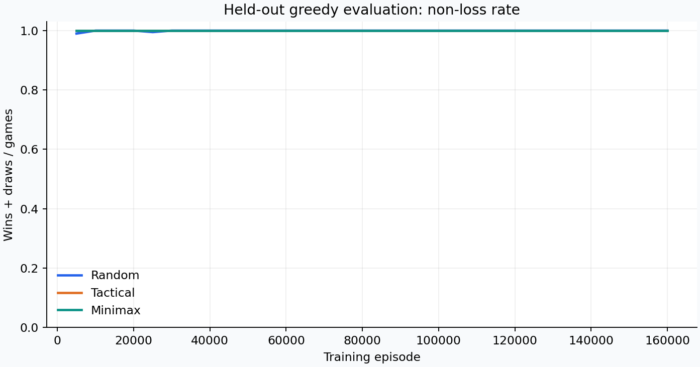
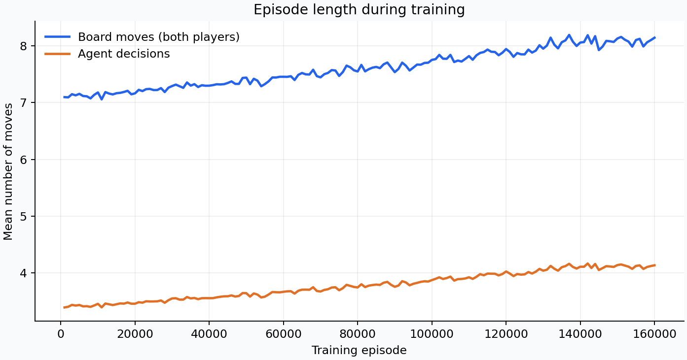

# Tic-Tac-Toe with Q-Learning

A Reinforcement Learning Lab CA mini project: train a tabular Q-learning agent and play Tic-Tac-Toe in a **Python notebook**. The board sits on the left; the Q-values for each AI decision appear on the right.

The agent learns from game outcomes and selects moves from its Q-table. Minimax is used during training, never to choose moves in the playable notebook.

## Play in Python

Open [TicTacToe_All_In_One.ipynb](notebooks/TicTacToe_All_In_One.ipynb) in Jupyter and run its **one Python code cell**. It trains the agent and records a 3×3 Q-table **for each of the nine human opening squares every 1,000 games**. The checkpoint tables are grouped by opening in tabs. After training, the plots appear before the game: reward, success rate, and steps versus episode; outcomes and best Q-value by human opening; the best Q-value's training progress for all nine openings; and nine AI-decision bar charts, one per opening. Expand the panels for the full training table and Q-table snapshots. The notebook also evaluates against random, tactical, and minimax opponents, then runs **1,000 games for each of the nine human first squares** against random X replies. These 9,000 games evaluate the trained, greedy policy; they do not update it. The playable 3×3 board sits beside its decision Q-values and an updating bar chart of all nine actions. Green marks the chosen action, blue marks other legal actions, and gray marks occupied squares. Choose X or O and use **New game** to reset. The notebook uses Python and `ipywidgets` for the game; a small inline style keeps button text black in dark notebook themes.

Open the plots directly: [training curves](artifacts/plots/notebook_training_plots.png), [results by human opening](artifacts/plots/notebook_opening_graphs.png), [Q-value progress for all openings](artifacts/plots/notebook_opening_q_progress.png), and [AI decisions for all openings](artifacts/plots/notebook_ai_decisions_all_openings.png). The decision chart in the running notebook updates after every AI move.

```bash
python -m pip install -r requirements.txt
jupyter notebook notebooks/TicTacToe_All_In_One.ipynb
```

The default 160,000-game run uses the same training configuration as the project and was checked against all 627 saved canonical states. Edit `EPISODES` in the notebook for a shorter demonstration. The interface uses `ipywidgets` and runs locally with Python and Jupyter.



## Optional browser version

1. [Download the project ZIP](https://github.com/shreejaykurhade/tic-tac-toe-qlearning-lab/archive/refs/heads/main.zip) and extract it.
2. Double-click **`TicTacToe_Offline.html`** to open it in Chrome, Edge, Firefox, or another modern browser.
3. Choose X or O and play. X always starts.

The standalone HTML includes the UI and trained model. **No internet, Python installation, server, or API key is needed to play.** Keep just this file if you only want the game.

Features include a responsive layout, keyboard navigation, a per-opponent scorecard, a random baseline opponent, and a toggle showing the agent's learned action values. The model remains fixed while you play. If browser storage is restricted, gameplay still works, but scores may not persist.

## Training results

The included model was trained for **160,000 episodes**, alternating equally between X and O, with seed **42**. Final evaluation used a separate seed, zero exploration, and **2,000 games per role per opponent**: 12,000 games total.

| Opponent | Games | Wins | Draws | Losses | Win rate | Non-loss rate |
|---|---:|---:|---:|---:|---:|---:|
| Random | 4,000 | 3,769 | 231 | 0 | 94.23% | 100% |
| Tactical | 4,000 | 676 | 3,324 | 0 | 16.90% | 100% |
| Minimax | 4,000 | 0 | 4,000 | 0 | 0% | 100% |

The zero-table baseline won 44.73% against random play and lost 87.45% against minimax. A draw is the best guaranteed outcome against perfect Tic-Tac-Toe play, so non-loss rate matters alongside win rate.

An exact adversarial game-tree audit found **zero worst-case loss probability from the empty board for both roles**, including all maximal-Q tie choices. This conclusion applies to the included saved policy and its greedy tie rule; it does not describe arbitrary forced board positions or exploratory play.

The model contains **627 canonical states**, expanded to **4,520 board orientations** for the browser. Detailed results, role breakdowns, seeds, and run provenance are in [evaluation.json](artifacts/evaluation.json) and [training_summary.json](artifacts/training_summary.json).

## How the learner works

- **State:** nine cells, encoded relative to the agent: `0` empty, `1` self, `2` opponent.
- **Action:** a legal empty square, indexed 0–8 in row-major order.
- **Reward:** win `+1`, draw `+0.3`, loss `−1`, ongoing transition `0`.
- **Transition:** the agent move plus the opponent response, so the next nonterminal state is the same agent's next decision.
- **Learning:** epsilon-greedy tabular Q-learning with legal-action masking and shared rotations/reflections.
- **Deployment:** select a legal maximal-Q action, breaking ties uniformly within `1e-12`. Unknown positions use a clearly labeled random fallback.

```text
Q(s,a) ← Q(s,a) + α [r + γ max_legal Q(s′,a′) − Q(s,a)]
```

Terminal transitions use `r` alone, without bootstrapping.

| Parameter | Value |
|---|---|
| Learning rate α | 0.15 |
| Discount factor γ | 0.97 |
| Exploration ε | Linear 1.00 → 0.03 over the first 85% of episodes; then 0.03 |
| Training episodes | 160,000 |
| Training opponent mixture | 25% random, 15% tactical, 60% minimax |
| Training seed | 42 |
| Log / checkpoint intervals | 1,000 / 5,000 episodes |

The opponent policy is sampled independently **at each opponent move**. Minimax is used as a training opponent and evaluation benchmark, not as the deployed agent. The tactical opponent takes an immediate win, blocks an immediate threat, then prefers the center, corners, and remaining edges.

## Run the Python experiment

Use **Python 3.10 or newer**. A CPU is sufficient.

```bash
git clone https://github.com/shreejaykurhade/tic-tac-toe-qlearning-lab.git
cd tic-tac-toe-qlearning-lab
python -m pip install -r requirements.txt
python -m unittest discover -s tests -v
python -m tictactoe.train --episodes 160000 --seed 42 --output artifacts --evaluation-games 2000
python scripts/build_offline.py
```

The final command rebuilds the standalone HTML and `artifacts/model.js` using your newly trained model. Training alone does not replace the model embedded in the standalone game.

Training writes the Q-table, summary, final evaluation, CSV logs, and four PNG plots into `artifacts/`. The game rules and learning engine use the Python standard library; Matplotlib and NumPy support plotting.

For a short demonstration, reduce `--episodes`. A shorter run can produce different performance from the included model. Repeat multiple seeds when comparing algorithms; the reported results come from one training seed.

## Notebook

The [one-cell Python notebook](notebooks/TicTacToe_All_In_One.ipynb) is the simplest way to train, examine the learning results, and play. It includes saved training tables and plots for the lab writeup. Its game Q-value panel updates with the agent's latest decision.

The earlier run's full Q-table history remains available as [1,600 snapshots every 100 games](artifacts/q_table_every_100.jsonl.gz) and a [checkpoint CSV](artifacts/q_table_index_every_100.csv). These are separate research artifacts; the playable notebook shows only the Q-values relevant to each current decision.

[Open the one-cell notebook in Colab](https://colab.research.google.com/github/shreejaykurhade/tic-tac-toe-qlearning-lab/blob/main/notebooks/TicTacToe_All_In_One.ipynb)

The older notebook below offers the same project as a guided sequence of smaller cells with additional graphs and a browser demonstration.

Open [TicTacToe_Q_Learning.ipynb](notebooks/TicTacToe_Q_Learning.ipynb) in Jupyter and run all cells in order. It embeds the project source, creates a temporary experiment folder, trains the agent, displays metrics and plots, runs the Python tests, and embeds the complete game in an iframe.

The included notebook was **executed locally: eight code cells completed with zero errors**. It is also compatible with Google Colab; a cloud execution is not claimed.

[](https://colab.research.google.com/github/shreejaykurhade/tic-tac-toe-qlearning-lab/blob/main/notebooks/TicTacToe_Q_Learning.ipynb)

Jupyter requires its packages to be installed locally. Once those dependencies are present, the notebook uses embedded source and does not need a project download at execution time. Running the notebook creates a new model in its temporary folder and does not overwrite the repository artifacts.

## Learning curves







Reward is shown in 1,000-episode exploratory training windows. Checkpoint non-loss rates use the greedy policy, 200 games per role per opponent. Longer episodes can indicate successful defense and full-board draws, rather than worse performance. Stable finite-run results with constant α are not a general proof of Q-learning convergence.

## College report

The report follows the Lab CA structure: problem definition, RL formulation, implementation, parameters, demonstration, results, graphs, analysis, limitations, future scope, conclusion, references, viva questions, and code appendix.

- [Editable Word report](report/LAB_CA_Report.docx)
- [PDF report](report/LAB_CA_Report.pdf)
- [Markdown report](report/LAB_CA_Report.md)

Fill in your student name, roll number, division/batch, and performance date before submission. Review the content against your college's formatting requirements.

The report builder reads the measured artifacts. To regenerate it, install `python-docx`, `reportlab`, and `Pillow`, then run `python scripts/build_report.py`. Those are optional report-authoring dependencies, not game dependencies.

## Project structure

```text
TicTacToe_Offline.html           Portable game with embedded trained model
index.html / styles.css / app.js Editable browser UI source
tictactoe/
  core.py                       Rules, symmetry transforms, opponent policies
  agent.py                      Q-learning and model export/load
  train.py                      Training, experiment output, plots
  evaluate.py                   Baseline evaluation and adversarial audit
notebooks/                      Executed, self-contained notebook
artifacts/                      Model, Q-table snapshots, results, plots, screenshots
report/                         Lab report in Word, PDF, and Markdown
scripts/                        Offline, notebook, and report builders
tests/                          Python and JavaScript checks
```

## Verification

```bash
python -m unittest discover -s tests -v
node --test tests/frontend.test.cjs
```

The Python checks cover all winning lines, draws, legal actions, terminal/nonterminal updates, symmetry/export agreement, random ties, and reproducibility. The JavaScript checks cover legal move selection, repeated clicks, restart races, playing as O, terminal scoring, fallback behavior, keyboard navigation, and restricted local storage. Node.js is needed only for these frontend checks.

The interface was also reviewed in a local browser preview at desktop and mobile sizes. The standalone file contains no remote game assets. Browser automation could not open `file://` directly, so the visual check served the same bundled HTML from localhost; the game itself requires no server.

## References

1. Sutton, R. S., & Barto, A. G. (2018). *Reinforcement Learning: An Introduction*, 2nd ed. [MIT Press](https://mitpress.mit.edu/9780262039246/reinforcement-learning/).
2. Watkins, C. J. C. H., & Dayan, P. (1992). “Q-Learning.” *Machine Learning*, 8, 279–292. [Paper](https://www.gatsby.ucl.ac.uk/~dayan/papers/cjch.pdf).
3. [Python documentation](https://docs.python.org/3/) and [Matplotlib documentation](https://matplotlib.org/stable/).
