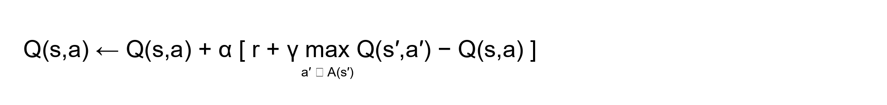
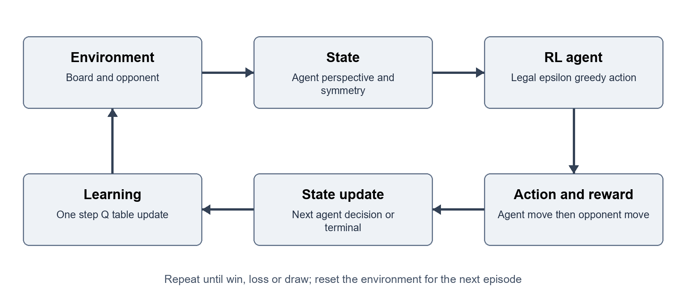

# Reinforcement Learning Lab CA

Mini Project Report

| Course Name | Reinforcement Learning | Semester | VII |
| --- | --- | --- | --- |
| Date of Performance | ___ / ___ / ______ | DIV / Batch No | ________________ |
| Student Name | ________________________ | Roll No | ________________ |

## 1. Title

Tic Tac Toe Agent Using Tabular Q Learning with an Interactive Game Interface

### Project overview

This project builds a reinforcement learning agent for the two player game Tic Tac Toe. The agent learns state-action values from repeated games and uses the resulting Q table to select legal moves. A fully offline browser interface lets a human play against the trained policy, inspect action values and restart games. A local Jupyter notebook exposes the training, evaluation and demonstration workflow and remains compatible with Google Colab.

The experiment separates learning from evaluation. A randomly acting baseline and the trained greedy policy are evaluated as both X and O against random, tactical and optimal minimax opponents. Wins, draws, losses, terminal reward and game length provide complementary views of policy quality. Evaluation uses independent random seeds and no exploration.

After 160,000 training episodes, the saved policy won 94.23% of 4,000 test games against a random opponent and drew all 4,000 games against minimax. It recorded 0 losses across 12,000 final evaluation games. A separate adversarial game-tree audit found zero loss probability from the empty board for both player roles under the saved greedy policy.

### Submission contents

- Python environment, Q-learning agent, training and evaluation scripts, and reproducible experiment artifacts.
- A self-contained offline browser game with its learned Q table embedded, and a locally runnable notebook.
- Measured results, learning curves, working screenshots, implementation explanations and a viva preparation section.

The report covers the problem, RL formulation, implementation, measured performance and limitations. References and source code excerpts follow the main report.


<!-- page break -->


## 2. Problem Definition and RL Formulation

### 2.1 Problem Statement

The task is to learn a decision policy that plays Tic Tac Toe effectively without storing a hand-written rule for every possible board. Two players alternate marking empty cells on a 3 by 3 board. X moves first. A player wins by completing a row, column or diagonal; a full board without a winning line is a draw. The agent must choose only legal actions and should maximize its expected discounted return over a game.

Tic Tac Toe is a controlled simulator for sequential decision making rather than a deployment in a physical system. It makes delayed consequences visible: a locally attractive move can allow an opponent to form a fork several turns later. The complete board is observable, actions are discrete, and each game ends within nine moves. These properties make the problem small enough for a tabular learning method and for direct inspection of the learned values.

### 2.2 Motivation

A supervised classifier would require labeled best moves. Q-learning instead uses interaction and reward. The agent explores moves, observes whether they eventually lead to a win, draw or loss, and adjusts the value of earlier choices. The project therefore demonstrates exploration, delayed reward, temporal difference updates and policy evaluation in an environment whose rules can be verified independently.

The game is also useful for understanding the limits of reinforcement learning. Strong play against a weak opponent does not imply perfect play against an optimal opponent. Evaluation against several opponent types, with separate results for starting and second player roles, exposes this distinction. The interface connects the numerical Q table with an observable sequence of decisions so a learner can explain both the update rule and its practical effect.

### 2.3 Objectives

- Implement a correct Tic Tac Toe environment with legal action masking, terminal detection and reproducible experiments.
- Train a tabular Q-learning policy through trial and error and save a reusable Q table.
- Compare the untrained baseline and trained policy across opponent strategies and player roles using measured metrics and learning curves.
- Provide a usable browser game and a Colab notebook that demonstrate the agent and expose its training process.

### Scope of the project

The project uses the standard 3 by 3 game. The agent observes the full board; no image recognition or external dataset is required. The opponent is part of the environment. Minimax is used as an opponent and evaluation reference, while the trained agent itself selects actions from its learned Q table.


<!-- page break -->


## 2.4 RL Problem Formulation

| RL component | Description |
| --- | --- |
| Environment | A standard 3 by 3 Tic Tac Toe board together with the opponent policy, legal move rules and terminal outcome detector. |
| State S | Nine cells encoded from the learner's perspective: own mark, opponent mark or empty. Only states at an agent decision are learned. Board rotations and reflections share a canonical state internally. |
| Action A | Select one of the empty cells, indexed 0 to 8 in row-major order. Occupied cells are masked from exploration, greedy selection and bootstrap maximization. |
| Reward R | Win +1.0; draw +0.3; loss -1.0; ongoing transition 0. Terminal outcome is measured from the learner's perspective. |
| Policy π | During training, epsilon-greedy action selection over legal cells. During evaluation and normal trained play, choose a legal action with maximal learned Q value. |
| Discount factor γ | 0.97; discounts return between successive agent decisions. |
| Episode and termination | One complete game. The episode ends immediately after a player wins or the board fills without a winner. A reset clears the board for the next game. |

### A transition includes the opponent response

An agent action does not usually lead directly to its next decision. The environment first applies the agent's move. If that move does not end the game, it applies the opponent's response. The resulting board is the next state for Q-learning. Thus one learning transition normally spans two individual moves. A terminal move may shorten the transition. Bootstrapping from a board where it is the opponent's turn would assign values to the wrong decision maker and is avoided.

### State normalization and symmetry

Encoding marks relative to the learner lets one table support both X and O. The eight square symmetries represent strategically equivalent boards. Canonicalization transforms the state and its action indices together; a selected action is mapped back to the original board before it is played. The web export expands learned values into ordinary board orientation so the browser can use a direct state lookup.

The opponent mixture remains fixed during training. This produces a stationary stochastic environment at the agent's decision times. Changing the opponent behavior after training changes the distribution of encountered states and can reveal weaknesses that were uncommon in training.


<!-- page break -->


## 2.5 Selected RL Algorithm

Name of algorithm: tabular Q-learning with an epsilon-greedy behavior policy.

Q-learning estimates the expected return of choosing an action in a state and then following a greedy policy. It is a model-free, off-policy temporal difference method: the behavior policy may explore, while the update target uses the highest value among legal next actions. The Tic Tac Toe state space is small enough to store these estimates explicitly, making the method easier to inspect than a neural value function.

### Q value update



Equation 1. One step Q-learning update for a nonterminal transition.

Here s is the current state, a is the chosen action, r is the observed reward, s′ is the next agent decision state, α is the learning rate and γ is the discount factor. The maximization considers only legal actions at s′. For a terminal transition, the bootstrap term is zero and the target is just the terminal reward. The temporal difference error is the target minus the current estimate.

### Exploration and exploitation

With probability epsilon, the agent samples a legal move to explore. Otherwise, it chooses a legal move with the largest current Q value. Epsilon decreases across training so early games cover alternatives and later games make more use of learned values. Random selection among tied legal maxima avoids introducing a permanent cell-order preference during learning and evaluation.

### Reason for selecting the algorithm

- The state and action spaces are discrete and small, so a dictionary-based Q table is practical.
- The update can be shown directly in code and explained using a single observed transition.
- No model of future game outcomes or labeled training dataset is required by the learner.
- The saved policy can be exported to a small client-side game without a model-serving service.

### Interpretation of the learned values

A Q value is an estimated discounted return under the training environment. It is not a calibrated win probability. The result depends on reward choices, discounting, opponent behavior, learning rate and state coverage. The browser's action-value view is therefore useful for comparison between legal actions on a board, but it should not be read as a guaranteed outcome against every opponent.

Classical convergence results require specific conditions, including sufficient repeated exploration and suitable learning-rate schedules. This finite experiment uses a practical fixed learning rate, so stable measured performance is treated as empirical evidence rather than proof of convergence to an optimal policy [1, 2].


<!-- page break -->


## 3. Implementation and Working of RL Agent

### 3.1 System Architecture and Workflow



Figure 1. Learning loop at the agent's decision times.

The environment owns game rules and board transitions. The opponent policies provide reproducible behavior at several strengths. The agent stores and updates state-action values. Training records a history and saves a learned policy; evaluation loads that policy without updating it. A single HTML file embeds the interface and exported policy, allowing browser play without a server or internet connection. The local notebook runs the Python workflow and displays its outputs.

### 3.2 Tools and Technologies

| Category | Project technology and use |
| --- | --- |
| Programming languages | Python for the simulator, Q-learning, training and evaluation; JavaScript, HTML and CSS for the browser game. |
| Libraries | Python standard library for the learning engine; NumPy 2.3.5 and Matplotlib 3.10.6 for numerical support and plots; notebook display tools for interactive outputs. |
| Development environment | Local Python execution and Jupyter notebook; source files retained in the project folder. The notebook can also be opened in Google Colab. |
| Simulator and dataset | A custom Tic Tac Toe simulator generates training trajectories. No external training dataset is used. |
| Saved artifacts | Q table in JSON, evaluation and training summaries in JSON, training history in CSV, and plotted learning curves. |
| Game delivery | TicTacToe_Offline.html bundles HTML, CSS, JavaScript and the learned Q table. Double-click to play locally with no backend or network dependency. |

The separation between game rules, learning and presentation makes each component easier to inspect. Replaying the learned table does not require retraining. The training scripts can regenerate the experiment artifacts, and the notebook presents the same process in an interactive environment.


<!-- page break -->


## 3.3 Algorithm Implementation

### Environment and legal actions

The board stores nine cell values. A legal-action function returns the indices of empty cells. Terminal detection checks the eight possible winning lines before declaring a full-board draw. Applying a move validates its legality, updates the board and determines whether the episode has ended. These rules are shared across training and evaluation so that metrics describe the same game.

### Training sequence

- Reset the board and assign the learner to X or O. If the learner is O, allow the opponent to make the opening move.
- Convert the current board to the learner's perspective and canonical orientation.
- Choose a legal action with the current epsilon-greedy policy and map the action back to the board.
- Apply the learner move. If the game continues, apply the opponent response and inspect the outcome again.
- Compute reward and the next state. Use reward alone at a terminal state; otherwise add the discounted best legal next-state value.
- Update the selected Q entry, record outcomes and continue until the episode terminates.

### Opponent strategies

| Opponent | Behavior and purpose |
| --- | --- |
| Random | Uniformly samples legal moves. Provides varied trajectories and a low-strength comparison. |
| Tactical | Take an immediate win; otherwise block an immediate opponent win, take the center, take a corner or select a remaining edge. It does not perform full game-tree search. |
| Minimax | Searches the remaining legal game tree to choose an optimal outcome. Serves as a strong training component and an evaluation reference. |

### Policy export and interface integration

After training, the Q table and training metadata are written to JSON. Symmetric states are expanded into the orientation expected by the browser. At each computer turn, the interface forms the same perspective state, masks occupied cells, and selects a legal action from the loaded values. User controls expose player role and game state; the learned values remain available for explanation.

The user-facing trained mode plays from Q values. The optimal search opponent is kept distinct in experiments so measured Q-learning behavior is not silently replaced with a search solution.


<!-- page break -->


## 3.4 Hyperparameters and Parameter Settings

| Parameter | Value |
| --- | --- |
| Learning rate α | 0.15 (constant) |
| Discount factor γ | 0.97 |
| Exploration rate ε | Linear 1.00 to 0.03 during the first 136,000 episodes; 0.03 thereafter |
| Number of episodes | 160,000 (80,000 as X and 80,000 as O) |
| Rewards | Win +1; draw +0.3; loss -1; ongoing 0 |
| Opponent mixture | Per move: random 25%, tactical 15%, minimax 60% |
| Seeds | Training 42; environment 43; checkpoint 2026; final evaluation 1002026 |
| Logging and checkpoints | 1,000-episode training windows; evaluate every 5,000 episodes |
| Evaluation games | Checkpoint: 200 per role/opponent; final: 2,000 per role/opponent |
| Greedy ties and initial Q | Uniform legal ties within 1e-12; unvisited values start at 0 |

### 3.5 Training Procedure

Training ran locally for 160,000 episodes with seed 42. The learner alternated X and O on successive episodes. On each opponent move, a new policy was sampled independently from the fixed mixture of 25% random, 15% tactical and 60% minimax. The run learned 627 canonical decision states and exported 4,520 board orientations for the browser.

Each game supplies a short sequence of decisions. Intermediate nonterminal transitions receive the configured step reward and use a discounted bootstrap target. Winning, losing or filling the board ends the episode, so terminal updates never read future action values. Rewards obtained after an opponent reply are attributed to the learner's preceding action through the same transition.

The learning rate controls how strongly a new target changes an existing value. A constant learning rate continues to adapt late in training, while epsilon decay shifts the behavior policy toward exploitation. Alternating player roles prevents training from covering only first-player openings. Symmetry reduces duplicated experience, but action indices must be transformed with the board for the update to remain correct.

### Reproducibility and evaluation separation

The untrained baseline uses an all-zero Q table with uniform random selection among tied legal actions. Both baseline and final policy were tested with epsilon zero in 2,000 games per role against each of three opponents: 12,000 games per policy. Final seed 1002026 differs from training and checkpoint seeds. The opponents are held fixed within each evaluation condition and Q values are not updated.

Training histories summarize the behavior actually used during learning, including exploration. Checkpoint evaluations use a greedy policy on separate games. These answer different questions: an exploratory training curve describes experience collection, whereas an evaluation curve estimates the current policy's performance without exploratory moves. The report labels them separately.


<!-- page break -->


## 3.6 Working Demonstration

The browser demonstration loads the trained Q table and accepts human moves on the board. The game reports whose turn it is, detects terminal outcomes, prevents moves in occupied cells and supports restarting. The interface exposes the learner's values so a selected move can be related to the Q-learning policy.

### Demonstration procedure

- Open the live game and start a new match with the desired player role.
- Select an empty cell and observe the learned agent's reply and action values.
- Continue until the game reports a win, loss or draw, then restart and change roles.
- Open the local notebook, run its cells and inspect the training and evaluation outputs.

The saved 160,000-episode training and final evaluation were executed locally on Windows. The self-contained browser game is opened from the local project folder. Notebook execution and interface checks are documented in the project verification artifacts.


<!-- page break -->


## 4. Results Analysis and Viva

### 4.1 Experimental Results

Table values below come directly from artifacts/evaluation.json. Each row pools 2,000 games as X and 2,000 as O. The same protocol evaluates the zero-table baseline and the saved trained policy.

| Policy | Opponent | Games | Win % | Draw % | Loss % | Avg reward |
| --- | --- | --- | --- | --- | --- | --- |
| Baseline | Random | 4,000 | 44.73 | 11.40 | 43.88 | 0.0427 |
| Baseline | Tactical | 4,000 | 0.73 | 9.22 | 90.05 | -0.8656 |
| Baseline | Minimax | 4,000 | 0.00 | 12.55 | 87.45 | -0.8368 |
| Trained | Random | 4,000 | 94.23 | 5.78 | 0.00 | 0.9596 |
| Trained | Tactical | 4,000 | 16.90 | 83.10 | 0.00 | 0.4183 |
| Trained | Minimax | 4,000 | 0.00 | 100.00 | 0.00 | 0.3000 |

Against random play, win rate increased from 44.73% to 94.23%. Against minimax, the baseline lost 87.45% of games, while the trained policy drew all games. The trained policy's average terminal reward was 0.9596, 0.4183 and 0.3000 against random, tactical and minimax opponents respectively.

### Performance by player role

| Role | Opponent | Games | Wins | Draws | Losses | Non-loss % |
| --- | --- | --- | --- | --- | --- | --- |
| X | Random | 2,000 | 1,947 | 53 | 0 | 100.00 |
| O | Random | 2,000 | 1,822 | 178 | 0 | 100.00 |
| X | Tactical | 2,000 | 676 | 1,324 | 0 | 100.00 |
| O | Tactical | 2,000 | 0 | 2,000 | 0 | 100.00 |
| X | Minimax | 2,000 | 0 | 2,000 | 0 | 100.00 |
| O | Minimax | 2,000 | 0 | 2,000 | 0 | 100.00 |

X has the opening move and O responds to the opening, so pooled performance can conceal role-specific weaknesses. These separate results help distinguish broad policy strength from a policy that mainly succeeds when moving first.

### Reading the result tables

Win rate and non-loss rate answer different questions. A draw against an optimal opponent is a successful defensive outcome, while a high draw rate against a random opponent may indicate missed winning opportunities. The loss rate remains essential even when average reward appears favorable.


<!-- page break -->


## 4.2 Performance Metrics

| Metric | Definition and interpretation |
| --- | --- |
| Cumulative reward | Sum of rewards over evaluated episodes. Its scale depends on the game count and configured terminal rewards. |
| Average reward | Total episode reward divided by games. Reported alongside outcome rates because reward depends on the chosen draw value. |
| Win rate | Wins divided by games. Measures conversion of games into victories. |
| Non-loss rate | Wins plus draws divided by games. Useful against strong opponents where drawing can be the best achievable result. |
| Game length | Individual board moves per episode, not the number of Q updates. Terminal games contain at most nine moves. |
| Empirical stability | Whether measured checkpoint performance stabilizes. It is not a mathematical proof of convergence. |

### 4.3 Graphs and Visualization


Figure 3. Mean terminal reward during training, measured in non-overlapping windows of 1,000 episodes.

The first training window averaged -0.6682 reward and the final window averaged 0.5165. These are exploratory training games against a per-move mixture, so they should not be equated with the final greedy evaluation. Total training reward was -4,799.3; early exploratory losses still contribute to this cumulative total.


<!-- page break -->


## 4.3 Learning Curves Continued


Figure 4. Greedy checkpoint non-loss rate; 400 games per opponent at each checkpoint, using seed 2026.


Figure 5. Mean board moves and agent decisions during training, summarized over 1,000 episodes.

Training non-loss rate rose from 21.0% to 97.0%. Mean game length changed from 7.097 to 8.145 board moves, consistent with fewer early losses and more full-board draws. Longer games are not automatically worse performance in this task.

### 4.4 Result Analysis

At the first 5,000-episode checkpoint, non-loss rates were 99.0% against random, 100.0% against tactical and 100.0% against minimax. Final checkpoint rates were 100.0%, 100.0% and 100.0%. The policy learned to avoid defeat and exploit weak responses. A nonzero exploration floor and stochastic opponent keep training losses and temporal difference error above zero.

The exact adversarial audit explores every opponent response reachable under the saved greedy policy, averaging all maximal-Q ties. It visited 132 learner states as X and 353 as O, with no unseen learner states. Worst-case loss probability was zero for both roles. This stronger result applies from the empty board with this policy and tie rule; it is not a claim about arbitrary forced board positions or exploratory modes.


<!-- page break -->


## 4.5 Limitations

- The environment is a fully observable 3 by 3 game. The tabular method does not scale directly to games with large or continuous state spaces.
- Performance depends on the training opponent mixture. A policy can exploit common mistakes while retaining weaknesses against adversarial move sequences.
- The experiment uses a finite training budget and a fixed learning rate. Stable curves do not establish the theoretical convergence conditions of Q-learning.
- Sampled evaluation results describe specified opponents and seeds. The separate exact audit covers this greedy policy from the empty board; it does not certify every arbitrary board setup or exploratory difficulty setting.
- Canonicalization and perspective encoding reduce duplicate states but demand correct state-action mapping. Incorrect transformations would silently corrupt action values.
- Action values are reward estimates, not probabilities. Interface users should interpret their ranking rather than treating a displayed value as a certainty.

## 4.6 Future Scope

An immediate extension is an audit of every valid board setup, including positions that the saved greedy policy never reaches from the empty board. This can identify a board where the learned action sacrifices an available draw or win after a forced demonstration move. Training across several independent seeds and reporting confidence intervals would better characterize variation than one reproducible run.

The project can compare Q-learning with SARSA, Monte Carlo control and dynamic programming under a common evaluation protocol. Additional experiments can vary the learning rate, epsilon schedule, discount factor and opponent mixture. A decaying learning-rate schedule and visitation counts would support a clearer study of convergence conditions. Larger boards or Connect Four would motivate function approximation, replay-based learning and more careful generalization tests.

The interface can add move-by-move replays and an explanation that links a selected action to its nearest competing legal action. A teaching mode could pause before the computer move, ask the learner to predict the update, and then reveal the reward and temporal difference error.

## 4.7 Conclusion

A tabular Q-learning agent was implemented and trained for 160,000 games using legal actions, agent-perspective states, symmetry sharing and two-move transitions. The trained greedy policy won 94.23% against random play, drew every sampled minimax game and lost none of 12,000 final test games. An exact adversarial audit also found no losing path from the empty board for either role under the saved greedy policy. These results demonstrate effective learned play within the stated evaluation scope.

The implementation connects the full RL workflow: a simulator produces experience, Q-learning updates action values, separate experiments measure performance, and an interactive game demonstrates the resulting behavior. The main lesson is that a learned policy must be assessed against the opponents and decision states relevant to its intended use, with wins, draws and losses all reported.


<!-- page break -->


## Viva Preparation

### Why is this reinforcement learning

The agent learns from its own state-action-reward transitions. No dataset provides a correct move label for every board. The objective is long-term return over a sequence of decisions.

### Why does the transition include an opponent move

The next Q state must be another point where the same agent can choose an action. Combining the learner move and opponent reply preserves that decision perspective. Terminal outcomes are handled immediately.

### Why is Q-learning off policy

The behavior policy can choose random exploratory actions, while the target uses the maximum legal next-action value. The target therefore evaluates a greedy continuation rather than the action actually chosen by the exploratory policy.

### Why are illegal moves masked

Only empty cells are valid. An occupied cell must be excluded from both action selection and the next-state maximum; otherwise an unused or arbitrary Q value could distort the update target.

### Does a high Q value equal a high win probability

No. Q values include discounting and the numeric rewards assigned to wins, draws and losses. They estimate return under the training environment rather than a calibrated probability.

### Why test against minimax

Minimax provides an optimal game-playing reference. Performance against random play can hide exploitable mistakes, while optimal opposition tests whether the learned policy can preserve a draw when a win cannot be forced.

### Why report both X and O

The two roles face different opening conditions. Reporting them separately can reveal whether the policy learned only strong first-player behavior or also learned to respond reliably as the second player.

### Can these curves prove convergence

No. They show empirical performance for a finite run. Formal Q-learning convergence depends on repeated state-action coverage and appropriate learning-rate conditions, which cannot be concluded from a smooth reward plot.

### How would you explain one update in the viva

Identify the board, legal action, received reward and next agent decision state. Find the largest legal next-state Q value, compute the target and subtract the current value to obtain the temporal difference error. Multiply that error by the learning rate and add it to the old Q value. Use zero bootstrap at a terminal state.


<!-- page break -->


## 5. References

[1] Richard S. Sutton and Andrew G. Barto. Reinforcement Learning: An Introduction. Second edition. MIT Press, 2018. Used for the reinforcement learning framework, temporal difference learning and off-policy control.

https://mitpress.mit.edu/9780262039246/reinforcement-learning/

[2] Christopher J. C. H. Watkins and Peter Dayan. Q-learning. Machine Learning, 8, 279-292, 1992. Used for the Q-learning algorithm and the distinction between practical finite training and theoretical convergence conditions.

https://www.gatsby.ucl.ac.uk/~dayan/papers/cjch.pdf

[3] Google. Colaboratory Frequently Asked Questions. Used for the notebook execution environment and its hosted runtime model. Accessed 4 October 2026.

https://research.google.com/colaboratory/intl/en-GB/faq.html

[4] Project source code, trained policy and reproducible experiment artifacts. Tic Tac Toe Q Learning Lab. The local project is the primary source for all measured numerical results in this report.

Local source folder: RL_LABCA

### Project access

Source code: tictactoe/ and scripts/ in the project folder.

Offline browser game: TicTacToe_Offline.html

Local notebook: notebooks/TicTacToe_Q_Learning.ipynb

### Experiment evidence

The machine-readable training configuration and summary are stored in artifacts/training_summary.json. Evaluation outcomes are stored in artifacts/evaluation.json. Training history and plotted figures accompany the report in the same local project. The report builder reads these saved outputs so displayed numerical results remain traceable to the experiment.

Experiment timestamp: 2026-10-04T10:35:49.798879+00:00. Runtime: Python 3.13.9 on Windows-11-10.0.26200-SP0. The recorded training loop time was 9.53 seconds; this excludes baseline evaluation, final evaluation, plotting, report creation and user interface verification.


<!-- page break -->


## Appendix A Source Code and Reproduction

The local project folder contains the complete runnable implementation. The following commands show the execution path; the notebook provides an interactive version of training and evaluation. The offline game itself needs only a browser.

```python
# From the RL_LABCA project folder
python -m pip install -r requirements.txt
python -m unittest discover -s tests -v
python -m tictactoe.train --episodes 160000 --seed 42

# Open TicTacToe_Offline.html by double-clicking it.
# Open notebooks/TicTacToe_Q_Learning.ipynb in Jupyter.
```

### Q-learning update

The excerpt below is taken from the project implementation. It shows the terminal target and the legal-action maximum used in the value update.

```python
if state[action] != "0":
    raise ValueError("Cannot learn an illegal action.")
key, permutation = canonicalize(state)
values = self.q.setdefault(key, [0.0] * 9)
canonical_action = permutation[action]
target = reward
if not done:
    if next_state is None:
        raise ValueError("A nonterminal update needs a next state.")
    next_values = self.values(next_state)
    actions = [a for a, cell in enumerate(next_state) if cell == "0"]
    if not actions:
        raise ValueError("A nonterminal next state needs a legal action.")
    target += self.gamma * max(next_values[a] for a in actions)
td_error = target - values[canonical_action]
values[canonical_action] += self.alpha * td_error
return abs(td_error)
```

### Reading the code

The update changes only the value of the state-action pair that produced the observed transition. A zero bootstrap at termination prevents the terminal result from being diluted by values on a board where no future decision exists. Legal masking ensures that an impossible occupied-cell move cannot become the target.

To reproduce the report, regenerate training and evaluation artifacts with the stated configuration, then run scripts/build_report.py in an environment with python-docx, reportlab and Pillow. The committed artifacts preserve the reported run even when a notebook user chooses a shorter demonstration budget.


<!-- page break -->


## Appendix B Sample Outputs and Verification

The following compact output reproduces values from the saved evaluation artifact. Outcomes are shown as wins / draws / losses for the trained policy, pooling the two player roles.

```python
{
  "episodes": 160000,
  "canonical_states": 627,
  "exported_states": 4520,
  "trained_outcomes": {
    "random": {
      "wins": 3769,
      "draws": 231,
      "losses": 0
    },
    "tactical": {
      "wins": 676,
      "draws": 3324,
      "losses": 0
    },
    "minimax": {
      "wins": 0,
      "draws": 4000,
      "losses": 0
    }
  },
  "worst_case_loss_probability": {
    "X": 0.0,
    "O": 0.0
  }
}
```

### Important implementation checks

- Environment tests check game rules, terminal states and legal actions.
- Agent tests check terminal updates, legal bootstrapping, symmetry mapping and exported-policy behavior.
- Final evaluation uses fresh seeds and disables exploration and Q-table updates.
- The exact adversarial audit explores every opponent response reachable under the saved greedy policy from the empty board.

### Files to inspect during demonstration

| File or folder | Purpose |
| --- | --- |
| tictactoe/ | Game rules, Q-learning behavior, opponent policies and experiment implementation. |
| artifacts/q_table.json | Saved learned values and policy metadata used by the browser. |
| artifacts/training_summary.json | Training configuration and run summary. |
| artifacts/evaluation.json | Measured baseline and trained evaluation outcomes. |
| artifacts/training_history.csv | Recorded learning history used to make graphs. |
| notebooks/TicTacToe_Q_Learning.ipynb | Local notebook for interactive training, evaluation and demonstration; compatible with Google Colab. |
| report/ | Submission report in PDF, Word and Markdown formats. |

Personal academic fields on the cover are intentionally left for the student to complete before submission.


<!-- page break -->
